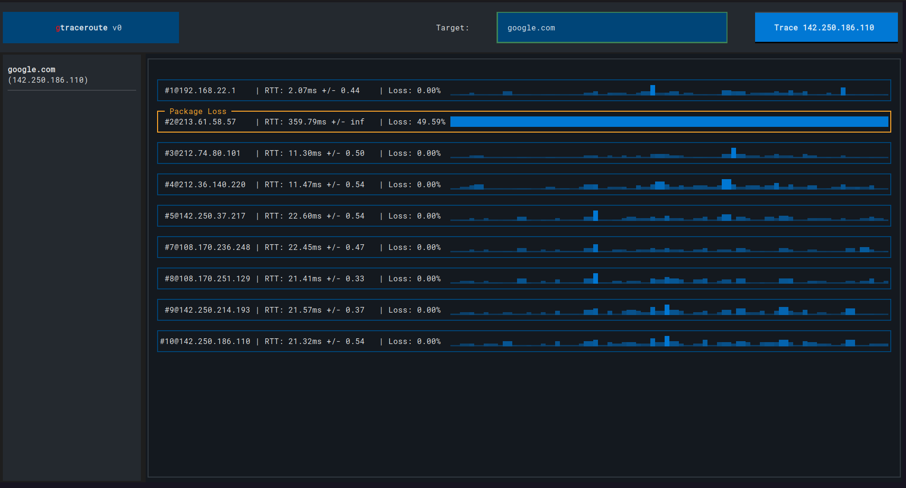

# gtraceroute




gtraceroute is a powerful terminal network diagnostic tool that combines the functionalities of traditional traceroute and the graphical user interface approach of PingPlotter. Implemented in Python, gtraceroute offers a terminal user interface (TUI) that provides real-time route tracing with a rich set of features including historical RTT plotting, comprehensive hop information, and an intuitive interface for revisiting previous trace targets.

---

## Features

- **IP/Name Search:** Allows you to search for an IP or name as the trace target.
- **Detailed Trace Info:** Lists comprehensive details for each hop in the trace route such as RTT (Round Trip Time), hop IPs, and more.
- **Historic RTT Plotting:** Provides a real-time graphical plot for RTTs over the course of the trace, enabling easier diagnosis of network issues.
- **Previous Target Recall:** Enables quick navigation to previous trace targets, improving usability for iterative diagnostics.

---

## Installation

gtraceroute requires Python 3.11 or above. Install it via `pip`:

```bash
pip install gtraceroute
```

---

## Usage

Simply run the `gtraceroute` command after installation.
```bash
gtraceroute
```

## How does on trace the route of an IP packet?!

### Sending UDP packets

gtraceroute uses UDP (User Datagram Protocol) packets as its method of exploration. Each packet is like a curious tourist on its way to a target - complete with a backpack of random goodies (random payload). Now, the whole Internet is a big place, so we need to keep track of where our tourists are going. This is where TTL (Time To Live) comes in.

### Receiving ICMP packets from intermediate routers

TTL is like a tourist's travel visa - when it runs out, their journey ends. Each network node along the path decreases the TTL by 1. We start by giving our tourist a TTL of 1, which means they can only visit the first stop (network node) before their visa expires.

When a tourist's visa expires (i.e., TTL hits zero), the stop they're at sends us a postcard with their picture (an ICMP packet). That's how we know how far they got! The ICMP packet contains the UDP header of the expired packet and sometimes even the payload.

After each tourist's trip, we increase the TTL by 1 for the next one, allowing them to go one stop further. This is like extending the visa duration for each subsequent tourist. In practise we of course send multiple tourists at the same time.

### Matching sent UDP packets to received ICMP packets

You may be wondering, how do we know which tourist is which when they send back their postcards (ICMP packets)? Good question!

If the postcard (ICMP packet) contains the UDP payload then we simply look up which UDP packet it belonged to.
In some cases, the ICMP packets sent back to us might only contain the UDP header without the payload. In such situations, we use a clever trick: we encode the TTL in the destination port contained in the UDP header!

This is like writing the duration of the visa on the tourist's hat in the picture. When we receive the postcard, we just need to look at the hat to know which tourist it is!


---

## License

MIT License. See [LICENSE](LICENSE) for more information.

---

## Contributing

We welcome contributions!

---

## Support

If you encounter any issues or have any questions about gtraceroute, please file an issue in the GitHub issue tracker.

---

## Acknowledgements

We would like to thank the Python community and the developers of traceroute and PingPlotter, whose tools inspired the development of gtraceroute.

---

## Disclaimer

Please use gtraceroute responsibly. It's designed as a diagnostic tool and not for unauthorized network probing.
